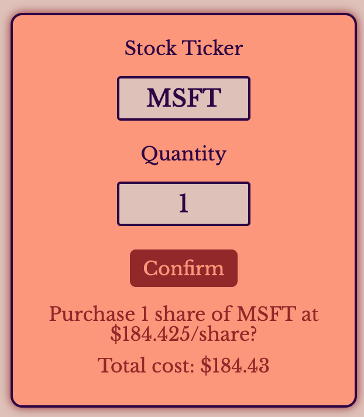

# Portefeuille

### A stock portfolio app completed for NYC Tech Talent Pipeline's coding challenge

## Technologies

#### Frontend:

React, Redux, jQuery, Webpack, Heroku, IEX Cloud. Redux organizes JSON information received from jQuery requests to the IEX Cloud API and the Rails backend. Portefeuille is hosted on Heroku. 

#### Backend: 

Ruby on Rails, PostgreSQL, Devise. Rails handles routing and serves JSON formatted responses from Postgres that get sent to and interpreted by the frontend. When users register, their password information is salted and hashed using Devise, a flexible and secure user authentication gem, before  user information is stored in the Postgres database. 

#### Models & Relations
```ruby
class User < ApplicationRecord
	validates :balance, numericality: { greater_than_or_equal_to: 0.0 }
	
	devise :database_authenticatable, :registerable,
			:recoverable, :rememberable, :validatable

	has_many :transactions, dependent: :destroy
	has_many :stocks, through: :transactions
end


class Transaction < ApplicationRecord
	validates :quantity, :stock_id, :user_id, :unit_price, presence: true
	validates :unit_price, numericality: { :greater_than => 0.0 }
	
	belongs_to :stock
	belongs_to :user
end


class Stock < ApplicationRecord
    validates :ticker, presence: true
    
    has_many :transactions, dependent: :destroy
    has_many :share_holders, through: :transactions, source: :users
end
```


## Buying stocks



Users input a stock ticker symbol and their desired quantity. On submit, Portefeuille gathers current information about the stock (company name and price) from the IEX Cloud api and confirms the total price with the user. The stock purchase form displays semantic error messages for invalid ticker names and insufficient funds and prevents users from requesting 

Backend validations on the User and Transaction database models ensure a further layer of protection from illegal requests: 

```ruby
# user.rb

def buy_stock(ticker, company, unit_price, quantity)
	stock = Stock.find_by_ticker(ticker)
	if !stock 
		stock = Stock.new(ticker: ticker, company: company)
		stock.save!
	end

	if self.balance >= quantity * unit_price
		transaction = self.transactions.new({
			stock_id: stock.id,
			unit_price: unit_price,
			quantity: quantity 
		})

		if transaction.valid?
			self.balance = self.balance - (quantity * unit_price)
			transaction.save
			self.save
			return transaction
		else 
			return false
		end
	else
		return false
	end
end
```

## Stock Portfolio and Transaction Ledger

The two main views of Portefeuille. The Stock Portfolio page shows users all of their stocks consolidated across many transactions and makes a batch request to IEX for market data on page load. Gains for the stock pricing are calculated on percent difference between `stock.latestPrice` and `stock.previousClose`. 

```ruby
@stocks = current_user
	.transactions
	.includes(:stock)
	.group(:stock)
	.sum('quantity')
	.to_a
```

The Transaction Ledger page shows an atomized view of all transactions with date of purchase and the buying price for those stocks at time of purchase. 

